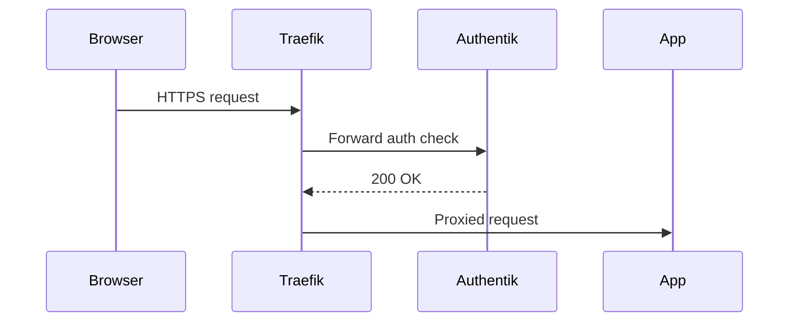

# Documentation Skill

## Table of Contents

1. [Purpose](#1-purpose)
2. [Document taxonomy](#2-document-taxonomy)
3. [Writing standards](#3-writing-standards)
4. [Structure standards](#4-structure-standards)
5. [Diagram standards](#5-diagram-standards)
6. [Anti-bloat rules](#6-anti-bloat-rules)
7. [Living document protocol](#7-living-document-protocol)
8. [draw.io XML guidance](#8-drawio-xml-guidance)
9. [Mermaid guidance](#9-mermaid-guidance)

---

## 1. Purpose

This file encodes the documentation standards and judgment conventions for the personal-site repository. It is loaded by an agent when a documentation task requires guidance beyond what the agent's role definition provides. It extends the behavioural rules in `.github/agents/documentation-agent.md`, which must also be loaded for any documentation task: that file defines role and scope; this file defines how to execute within that scope at a level of detail sufficient to produce well-formed documents without additional context.

---

## 2. Document taxonomy

| Document type | Location | Audience | Living or point-in-time |
|---|---|---|---|
| Architecture | `docs/architecture.md` | All contributors | Living |
| Architecture Decision Record | `docs/adrs/ADR-NNN-title.md` | All contributors | Point-in-time |
| Hosting setup | `docs/hosting-setup.md` | Operators | Living |
| CI/CD pipeline | `docs/ci-cd-pipeline.md` | All contributors | Living |
| Style guide | `docs/style-guide.md` | Implementer agent, contributors | Living |
| Implementation phases | `docs/implementation-phases.md` | All contributors | Living |
| Diagram source | `docs/diagrams/*.drawio` | Agent and consumers | Point-in-time |
| Diagram export | `docs/diagrams/*.png` | All consumers | Derived — human export step required |
| Documentation registry | `docs/registry.md` | All contributors | Living |
| Issue template | `docs/templates/issue-template.md` | All contributors | Living |
| ADR template | `docs/templates/adr-template.md` | All contributors | Living |
| Repository README | `README.md` | All visitors | Living |

This project does not use runbooks. A living document is updated whenever the system or process it describes changes. A point-in-time document captures a decision or state at a specific moment and is not edited after acceptance.

---

## 3. Writing standards

### Tone and tense

All engineering documents use declarative present tense. Every sentence describes what the system does or what a rule requires. Conditional and aspirational language are not used in engineering documents.

Correct: "The platform routes all external traffic through Traefik."
Incorrect: "We decided Traefik would be the ingress controller."

Correct: "A metadata block is required at the top of every document."
Incorrect: "You should add a metadata block."

Hedging constructions — "may be", "could be", "should be" — are replaced by definitive statements where the rule is clear. Where genuine uncertainty exists, the uncertainty is stated explicitly: "The behaviour in this scenario is undefined pending ADR-NNN."

### Person and voice

No first or second person in engineering documents. No "I", "we", "you", "our", or "your". All sentences are third-person or impersonal.

Active constructions are preferred over passive where the subject is clear. "ArgoCD reconciles cluster state" is preferred over "Cluster state is reconciled by ArgoCD."

### Sentence structure

Sentences are short. A sentence that requires a semicolon is a candidate for splitting. A sentence that requires a parenthetical clause longer than five words is likely two sentences.

One idea per sentence. One topic per paragraph. One topic per section.

### Headings

Headings use sentence case throughout. "Security model" is correct; "Security Model" is not. Heading text must match the anchor used in the table of contents exactly after lowercasing and hyphenating spaces.

### Emphasis

Bold is used for inline labels, key terms on first introduction, and table column headers that require emphasis. It is not used decoratively or to emphasise entire sentences.

Italic is used for document titles on first reference and for the first occurrence of a technical term being defined inline.

Code formatting (backticks) is used for file paths, command-line tokens, Kubernetes resource names, configuration keys, and any string that must be reproduced exactly.

---

## 4. Structure standards

### Metadata block

Every document starts with a metadata block in the following format:

```markdown
> **Version:** 1.0
> **Status:** Living document — updated when [trigger]
> **Related:** [Document or ADR title](relative/path.md)
```

The status field describes the document lifecycle. Living documents state their update trigger inline. Point-in-time documents state "Accepted" once approved.

### Table of contents

A table of contents is required for any document that contains more than four sections. It uses numbered entries with anchor links. Anchors are derived from heading text: lowercased, spaces replaced by hyphens, punctuation removed.

### Section ordering

Documents follow this ordering convention:

1. Metadata block
2. Table of contents (if required)
3. Overview or purpose (one or two paragraphs)
4. Body sections — operational detail, reference tables, decision rationale
5. References or related documents (final section, if needed)

Context and purpose are placed before operational detail. Reference material is placed after instructional content.

---

## 5. Diagram standards

### Decision table

| Diagram need | Format | Rationale |
|---|---|---|
| System architecture, hardware boundaries, network topology | draw.io `.drawio` + exported `.png` | Supports nested containers, phase colour coding, and complex layout |
| Sequence diagrams, request flows, API call chains | Mermaid `sequenceDiagram` | Renders natively on GitHub; agent-updatable as plain text without an export step |
| State machines, decision flows, process steps | Mermaid `flowchart` or `stateDiagram-v2` | Same agent-updatable advantage; suited to linear and branching logic |
| Structured reference data — tech stack, ADR index, hardware inventory | Markdown table | No diagram overhead; fully agent-updatable; scannable without rendering |
| Rationale, constraints, system context | Prose | Requires explanation that no diagram or table can provide |
| Relationships between two or three components | Inline Mermaid or table | draw.io is disproportionate for low-complexity relationships |

The practical division follows structural stability. Architecture and topology change rarely and warrant the draw.io workflow. Flows and sequences change frequently and benefit from Mermaid's plain-text format.

### Worked examples

**draw.io:** A diagram showing which hardware node hosts which Kubernetes workloads, with phase labels and nested hardware boundary boxes, is a structural architecture diagram. It changes only when hardware is added or workloads are redistributed. Use draw.io.

**Mermaid:** A diagram showing the request path from browser through Traefik to an application pod, including the Authentik authentication check, is a sequence flow. New applications alter this flow. Use `sequenceDiagram`.

**Table:** The technology stack listing — tool, version, phase introduced, purpose — is structured reference data with no directional flow. Use a Markdown table.

**Prose:** The rationale for choosing k3s over full Kubernetes requires explaining hardware constraints and operational tradeoffs that no diagram or table can capture. Use prose.

---

## 6. Anti-bloat rules

These rules are named for precise reference in reviews and PR descriptions.

**one-document rule:** If content already exists in a document that can be linked, link to it. Do not copy the content into the current document.

**table-first rule:** If a section can be fully expressed as a table, it is expressed as a table. A prose paragraph listing attributes of multiple items is a candidate for conversion.

**diagram-first rule:** If a section describes a flow, sequence, or state machine in prose, and a Mermaid diagram would communicate it more clearly, the diagram replaces the prose. Prose may accompany the diagram only to provide context the diagram cannot carry.

**trim-before-add rule:** Before adding content to an existing document, the agent checks whether any existing section can be shortened or removed. Net document length is not allowed to grow unboundedly across edits.

**single-section rule:** A section is not added unless it contains information not covered elsewhere in the same document or in a document linked from it.

**heading-earns-its-place rule:** A heading that introduces fewer than two substantive sentences of unique content is not a heading. Its content is merged into the parent section or removed.

---

## 7. Living document protocol

### When to update

A living document requires an update when any of the following are true:

- The system or process it describes has changed
- Its last-verified date in `docs/registry.md` is older than 90 days and the system has changed in that period

### How to update

1. Read the full document before making any change
2. Identify whether the change is an addition, a correction, or a structural update
3. For additions: apply the `one-document rule` — confirm the content is not already covered elsewhere
4. For corrections: update the content and increment the version in the metadata block
5. For structural updates: note in the PR description which other documents may be affected
6. Update the row for this document in `docs/registry.md` — increment version, update last-verified date

### Version numbering

Versions follow `major.minor` notation:

- Increment **minor** for content additions, corrections, or section updates: `1.0 → 1.1`
- Increment **major** for structural rewrites, significant reorganisation, or removal of substantial content: `1.1 → 2.0`

Point-in-time documents are not versioned after acceptance. A new document is created to record a change rather than editing the original.

---

## 8. draw.io XML guidance

### When to generate

An agent generates a `.drawio` XML file only when the issue explicitly requests a new architecture diagram or an update to an existing one. The agent commits the XML file to `docs/diagrams/`. The PNG export is a human step: a human opens the file in draw.io desktop or at app.diagrams.net, verifies the layout, exports as PNG at the same path, and commits the PNG alongside the source. The agent never produces the PNG.

### Required XML structure

Every draw.io file follows this skeleton:

```xml
<mxfile host="app.diagrams.net">
  <diagram id="[unique-id]" name="Page-1">
    <mxGraphModel dx="1664" dy="916" grid="1" gridSize="10" guides="1"
                  tooltips="1" connect="1" arrows="1" fold="1" page="1"
                  pageScale="1" pageWidth="1654" pageHeight="1169"
                  math="0" shadow="0">
      <root>
        <mxCell id="0" />
        <mxCell id="1" parent="0" />
        <!-- diagram cells here -->
      </root>
    </mxGraphModel>
  </diagram>
</mxfile>
```

Cells `0` and `1` are always present and unchanged. All content cells use `parent="1"` unless they are children of a container cell.

### Colour conventions

Colour conventions are established in `docs/diagrams/hosting-architecture.drawio`. Before generating a new diagram, read that file to extract the `fillColor`, `strokeColor`, and `fontColor` values in use. Do not introduce new colours.

### Cell ID naming conventions

Cell IDs use descriptive snake_case. The conventions from the existing diagram define the naming standard for all future diagrams:

| Element type | ID pattern | Examples |
|---|---|---|
| Boundary container | noun or noun phrase | `home_network`, `dell_boundary` |
| Boundary label (text cell) | `{boundary_id}_label` | `home_label`, `dell_label` |
| Component | lowercase component name | `ingress`, `argocd`, `authentik` |
| Phase badge on a component | `{component_id}_phase` | `ingress_phase`, `argocd_phase` |
| Legend item | `leg{N}` | `leg1`, `leg2`, `leg6` |
| Diagram title | `title` | `title` |

IDs must be unique within the file.

---

## 9. Mermaid guidance

### Supported diagram types

| Type | Syntax keyword | Use case |
|---|---|---|
| Sequence diagram | `sequenceDiagram` | Request flows, API call chains, authentication sequences |
| Flowchart | `flowchart TD` or `flowchart LR` | Decision flows, process steps, deployment pipelines |
| State machine | `stateDiagram-v2` | Component lifecycle, application states |

Other Mermaid diagram types are not prohibited but must be validated with care — GitHub rendering support varies by type.

### Syntax validation

Mermaid syntax errors fail silently on GitHub: an invalid diagram renders as blank with no error message. Before committing any Mermaid block, validate the syntax using the Mermaid Live Editor at mermaid.live or a local Mermaid CLI. A diagram that has not been validated must not be committed.

### GitHub rendering

Mermaid diagrams render natively in GitHub Markdown using fenced code blocks with the `mermaid` language identifier. No plugin or extension is required.

````markdown

````

### Complexity limit

If a diagram exceeds 15 nodes or 20 edges, it is split into two diagrams. A short prose sentence links them: "The following diagram continues from the point labelled X in the diagram above." Reducing label detail or merging unrelated steps to stay under the limit is not acceptable — split the diagram instead.