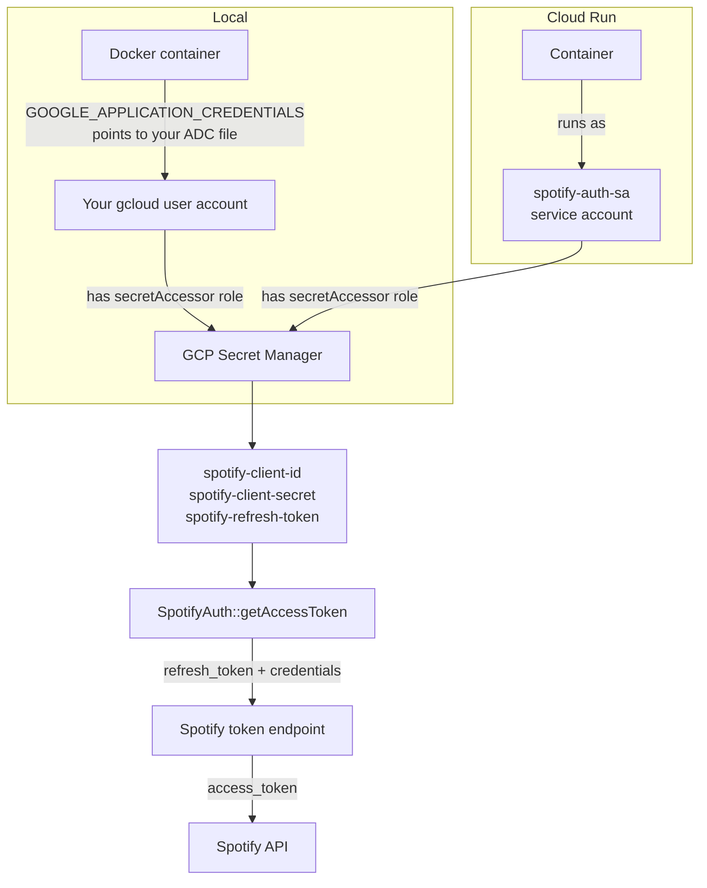

> **Related:** [SpotifyAuth implementation](src/SpotifyAuth.h) | [Dockerfile](Dockerfile)

# Backend setup

This document covers the one-time manual steps required to run the backend locally and deploy it to Cloud Run. No secret values appear here. Commands use placeholder names where real values are required.

---

## Credential flow



The C++ code is identical in both environments. Only the identity used to authenticate against Secret Manager differs.

---

## Table of contents

1. [Prerequisites](#prerequisites)
2. [GCP project setup](#gcp-project-setup)
3. [Spotify app and refresh token](#spotify-app-and-refresh-token)
4. [Storing secrets in Secret Manager](#storing-secrets-in-secret-manager)
5. [Local development](#local-development)
6. [Production on Cloud Run](#production-on-cloud-run)

---

## Prerequisites

- `gcloud` CLI installed and authenticated (`gcloud auth login`)
- Docker Desktop running
- A Spotify account

---

## GCP project setup

### Service account

```bash
gcloud iam service-accounts create spotify-auth-sa \
  --project=personal-site-497615 \
  --display-name="Spotify Auth Service Account"
```

### IAM binding

Grant the service account read-only access to secrets:

```bash
gcloud projects add-iam-policy-binding personal-site-497615 \
  --member="serviceAccount:spotify-auth-sa@personal-site-497615.iam.gserviceaccount.com" \
  --role="roles/secretmanager.secretAccessor"
```

---

## Spotify app and refresh token

This is a one-time flow to obtain a long-lived refresh token from Spotify.

### Step 1 — Create a Spotify app

1. Go to https://developer.spotify.com/dashboard
2. Create an app with any name
3. Add `http://127.0.0.1:8888/callback` as a redirect URI (exact string, no trailing slash)
4. Note the **Client ID** and **Client Secret**

### Step 2 — Authorize and get an authorization code

Open this URL in a browser, replacing `YOUR_CLIENT_ID`:

```
https://accounts.spotify.com/authorize?client_id=YOUR_CLIENT_ID&response_type=code&redirect_uri=http%3A%2F%2F127.0.0.1%3A8888%2Fcallback&scope=user-read-currently-playing%20user-read-recently-played
```

Log in and approve. The browser redirects to `http://127.0.0.1:8888/callback?code=...` — the page will not load (nothing is listening), but copy the `code` value from the address bar.

### Step 3 — Exchange code for a refresh token

```bash
curl -s -X POST https://accounts.spotify.com/api/token \
  -H "Content-Type: application/x-www-form-urlencoded" \
  -u "YOUR_CLIENT_ID:YOUR_CLIENT_SECRET" \
  -d "grant_type=authorization_code&code=YOUR_CODE&redirect_uri=http%3A%2F%2F127.0.0.1%3A8888%2Fcallback"
```

The response contains `refresh_token`. This value does not expire unless explicitly revoked.

---

## Storing secrets in Secret Manager

Create the three secrets, then add each value. Use stdin to avoid the value appearing in shell history.

```bash
# Create secrets
gcloud secrets create spotify-refresh-token  --project=personal-site-497615 --replication-policy="automatic"
gcloud secrets create spotify-client-id      --project=personal-site-497615 --replication-policy="automatic"
gcloud secrets create spotify-client-secret  --project=personal-site-497615 --replication-policy="automatic"

# Add values (run each separately, replacing the placeholder)
echo -n "PASTE_VALUE_HERE" | gcloud secrets versions add spotify-refresh-token  --project=personal-site-497615 --data-file=-
echo -n "PASTE_VALUE_HERE" | gcloud secrets versions add spotify-client-id      --project=personal-site-497615 --data-file=-
echo -n "PASTE_VALUE_HERE" | gcloud secrets versions add spotify-client-secret  --project=personal-site-497615 --data-file=-
```

Verify access:

```bash
gcloud secrets versions access latest --secret=spotify-refresh-token --project=personal-site-497615
```

---

## Local development

The container uses Application Default Credentials (ADC) from the host machine. No service account key file is needed.

### Step 1 — Set up ADC

```bash
gcloud auth application-default login
```

Grant your user account access to secrets (one-time):

```bash
gcloud projects add-iam-policy-binding personal-site-497615 \
  --member="user:YOUR_GOOGLE_EMAIL@gmail.com" \
  --role="roles/secretmanager.secretAccessor"
```

### Step 2 — Build the image

```bash
cd backend
docker build -t personal-site-backend .
```

### Step 3 — Run with ADC mounted

```bash
docker run --rm \
  -v "$HOME/.config/gcloud/application_default_credentials.json:/tmp/adc.json:ro" \
  -e GOOGLE_APPLICATION_CREDENTIALS=/tmp/adc.json \
  -p 8080:8080 \
  personal-site-backend
```

### Step 4 — Verify

```bash
curl http://localhost:8080/health
# expected: {"status":"ok"}
```

To verify the full token exchange without the container:

```bash
REFRESH_TOKEN=$(gcloud secrets versions access latest --secret=spotify-refresh-token --project=personal-site-497615)
CLIENT_ID=$(gcloud secrets versions access latest --secret=spotify-client-id --project=personal-site-497615)
CLIENT_SECRET=$(gcloud secrets versions access latest --secret=spotify-client-secret --project=personal-site-497615)

curl -s -X POST https://accounts.spotify.com/api/token \
  -H "Content-Type: application/x-www-form-urlencoded" \
  -u "$CLIENT_ID:$CLIENT_SECRET" \
  -d "grant_type=refresh_token&refresh_token=$REFRESH_TOKEN"
```

A successful response contains `access_token`.

---

## Production on Cloud Run

On Cloud Run no key file or ADC is required. Assign `spotify-auth-sa` as the service's runtime identity at deploy time:

```bash
gcloud run deploy personal-site-backend \
  --image=REGION-docker.pkg.dev/personal-site-497615/REPO/personal-site-backend:TAG \
  --service-account=spotify-auth-sa@personal-site-497615.iam.gserviceaccount.com \
  --region=REGION \
  --project=personal-site-497615
```

The service account already holds `roles/secretmanager.secretAccessor`. No further credential configuration is needed inside the container.
