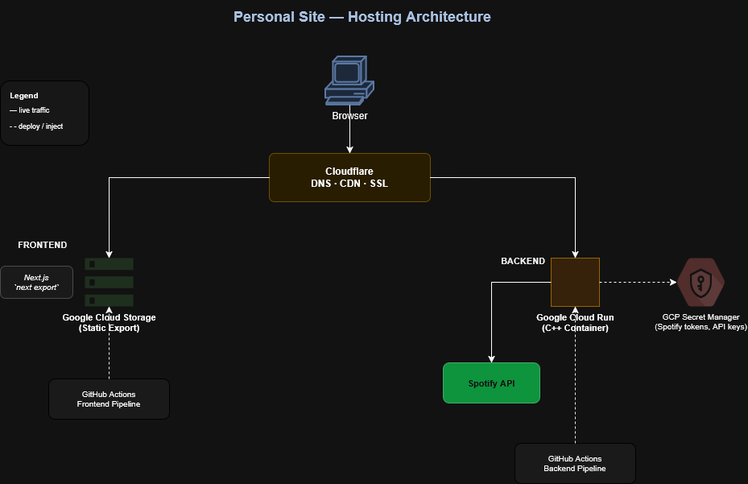

> **Version:** 1.0
> **Status:** Living document — updated when the hosting architecture or technology stack changes
> **Related:** [Hosting setup](hosting-setup.md) | [CI/CD pipeline](ci-cd-pipeline.md)

# Architecture

## Table of contents

1. [Stack summary](#1-stack-summary)
2. [Architecture overview](#2-architecture-overview)
3. [Frontend](#3-frontend)
4. [Backend](#4-backend)
5. [DNS and CDN](#5-dns-and-cdn)
6. [CI/CD](#6-cicd)
7. [Cost profile](#7-cost-profile)
8. [Portability](#8-portability)
9. [Phased rollout](#9-phased-rollout)

---

## 1. Stack summary

| Concern | Solution |
|---|---|
| Frontend hosting | Google Cloud Storage (static export) |
| Backend / API | Google Cloud Run (Docker container) — Phase 2+ |
| Language (backend) | C++ (Drogon or Crow) — Phase 2+ |
| DNS and CDN | Cloudflare (free tier) |
| Secrets | GCP Secret Manager — Phase 3+ |
| CI/CD | GitHub Actions |
| Spotify integration | Cloud Run proxy — Phase 5 |

---

## 2. Architecture overview

```
Browser
  └── Cloudflare DNS + CDN + SSL
        ├── Frontend  →  Google Cloud Storage (static HTML/JS/CSS)
        └── API calls →  Google Cloud Run (C++ container)
                              └── Spotify API
```


> Diagram source: [docs/diagrams/hosting-architecture.drawio](./diagrams/hosting-architecture.drawio). Update and re-export the PNG when the architecture changes.

---

## 3. Frontend

| Property | Value |
|---|---|
| Framework | Next.js with TypeScript and Tailwind CSS |
| Build output | `next export` — fully static, no SSR at runtime |
| Hosting | GCS bucket configured for static website hosting |
| Asset path | `out/` |

Static output is CDN-friendly and portable. The frontend has no server dependency at runtime.

---

## 4. Backend

The backend exists solely to proxy secrets-bearing API calls. It holds no user data and exposes no public write endpoints.

| Property | Value |
|---|---|
| Language | C++ using Drogon (preferred) or Crow |
| Deployment | Docker image → GCP Artifact Registry → Cloud Run |
| Design constraint | No database, no auth system, no microservices |

Cloud Run provides HTTPS out of the box, a generous free tier, and scales to zero between requests.

The backend is a Phase 2+ deliverable and is not yet deployed.

---

## 5. DNS and CDN

Cloudflare manages DNS, SSL termination, and CDN caching. DNS records point to GCS and Cloud Run. The records can be repointed to any host without code changes.

SSL certificates for `scott-taylor11.com` and `www.scott-taylor11.com` are issued and renewed automatically by Cloudflare in Proxied mode. GCS does not terminate SSL.

---

## 6. CI/CD

GitHub Actions handles all automated deployment. Authentication to GCP uses Workload Identity Federation — no JSON keys are stored in GitHub.

| Pipeline | Trigger | Steps |
|---|---|---|
| Frontend | Push to `main` | Build static export → sync to GCS |
| Backend | Push to `main` (Phase 2+) | Build Docker image → push to Artifact Registry → deploy to Cloud Run |

See [CI/CD pipeline](ci-cd-pipeline.md) for full details.

---

## 7. Cost profile

| Resource | Expected cost |
|---|---|
| Domain | ~£8–15/year |
| Cloudflare | Free |
| GCS hosting | Pennies/month |
| Cloud Run | Free tier for low traffic |
| **Total** | **< £20/year** |

---

## 8. Portability

Static files move to Netlify, Cloudflare Pages, AWS S3, or any CDN with no code changes. The backend Docker container runs on AWS ECS, DigitalOcean, a plain VPS, or any container host.

---

## 9. Phased rollout

| Phase | Goal | Status |
|---|---|---|
| 1 | Frontend hosted on GCS, custom domain, Cloudflare DNS + HTTPS | Complete |
| 2 | Dockerised C++ API deployed to Cloud Run | Planned |
| 3 | Spotify integration via Cloud Run + Secret Manager | Planned |
| 4 | GitHub Actions CI/CD for frontend | Complete |
| 4+ | GitHub Actions CI/CD for backend | Planned |
| 5 | Optional: Cloud CDN, monitoring, analytics, globe | Planned |
