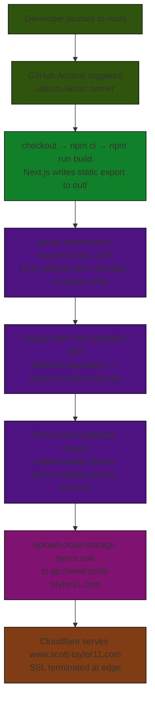

> **Version:** 1.0
> **Status:** Living document — updated when the deploy workflow changes
> **Related:** [Deploy frontend workflow](../.github/workflows/deploy-frontend.yml) | [Architecture](architecture.md)

# CI/CD deployment pipeline

Documents the automated deployment pipeline that builds and publishes the static site on every push to `main`.

---

## Overview

Every push to `main` triggers the `Deploy frontend` GitHub Actions workflow. The workflow runs on an `ubuntu-latest` runner and executes the following stages in sequence:

| Stage | Steps |
|---|---|
| Build | checkout → `npm ci` → `npm run build` |
| Auth | request OIDC JWT → exchange at WIF → impersonate service account |
| Deploy | sync `out/` to GCS bucket |

The site is then served to users via Cloudflare, which proxies requests to the GCS origin and handles SSL termination.

---

## Authentication: Workload Identity Federation

The workflow uses keyless authentication. No JSON key or long-lived credential is stored in GitHub.

| Component | Value |
|---|---|
| WIF Pool | `github-actions-pool` |
| WIF Provider | `github-provider` |
| GCP Project number | `78372225567` |
| Service account | `github-actions-deploy@personal-site-497615.iam.gserviceaccount.com` |
| Attribute condition | `attribute.repository == "staylor11x/personal-site"` |

Auth flow:

1. The runner requests a signed JWT from GitHub's OIDC endpoint. The workflow job must declare `id-token: write` permission.
2. `google-github-actions/auth` exchanges the JWT at the WIF Pool. Google validates the token signature and checks that the `repository` attribute matches the allow condition.
3. Google issues a short-lived access token scoped to the service account via impersonation (`roles/iam.workloadIdentityUser`).
4. All subsequent `gcloud` and GCS API calls use this token. It expires after the job ends.

---

## Service account permissions

The service account holds `roles/storage.objectAdmin` on `gs://www.scott-taylor11.com` only. It has no project-wide IAM permissions.

---

## Deployment step

`google-github-actions/upload-cloud-storage` syncs the contents of `out/` to the bucket root. The bucket is configured with `web-main-page-suffix: index.html` and serves files via the GCS website hosting endpoint, which Cloudflare uses as its origin.

---

## Backend: Deploy workflow

- **Workflow path**: [.github/workflows/deploy-backend.yml](.github/workflows/deploy-backend.yml)
- **Trigger**: `push` to `main` when changes include files under the `backend/**` path. Pushes that only modify `app/` or frontend files will not trigger this workflow.

Configuration placeholders to replace before enabling the workflow:

- **PROJECT_ID**: Set your GCP project ID.
- **REGION**: Set the Cloud Run region (for example `us-central1`).
- **ARTIFACT_REGISTRY**: Full Artifact Registry repository host and path, e.g. `us-central1-docker.pkg.dev/PROJECT_ID/personal-site-backend`.

Auth and WIF resources:

- This workflow reuses the existing Workload Identity Federation pool and provider named `github-actions-pool` and `github-provider`.
- The workflow authenticates with `google-github-actions/auth` and impersonates the `github-actions-deploy` service account. It does NOT create new WIF pools/providers or new secrets.

Manual IAM steps required (one-time):

1. Ensure the service account `github-actions-deploy@<PROJECT_ID>.iam.gserviceaccount.com` exists in your GCP project.
2. Grant the following IAM roles to that service account (minimal permissions for this flow):
   - `roles/artifactregistry.writer` on the Artifact Registry repository (or project-scoped if appropriate)
   - `roles/run.developer` on the project (or narrower scope as desired)

Notes:

- The workflow tags images with the short Git commit SHA (7 chars) and pushes them to the configured Artifact Registry repository.
- Replace the `PROJECT_NUMBER` placeholder in the workflow's `workload_identity_provider` value if your setup requires the numeric project identifier.
