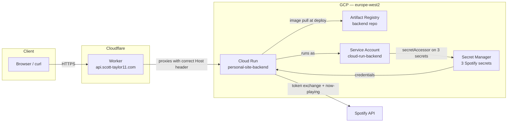

> **Version:** 1.2
> **Status:** Living document — updated when the GCS, Cloud Run, or Cloudflare configuration changes
> **Related:** [Architecture](architecture.md) | [CI/CD pipeline](ci-cd-pipeline.md)

# Hosting setup

Documents the end-to-end configuration for hosting the static site on Google Cloud Storage and the API backend on Cloud Run, with Cloudflare handling DNS, HTTPS, and CDN.

## Table of contents

1. [GCS bucket setup](#1-gcs-bucket-setup)
2. [Cloudflare setup](#2-cloudflare-setup)
3. [DNS records](#3-dns-records)
4. [Apex redirect rule](#4-apex-redirect-rule)
5. [HTTPS](#5-https)
6. [Reference commands](#6-reference-commands)
7. [Verification checklist](#7-verification-checklist)
8. [Backend service](#8-backend-service)

---

## 1. GCS bucket setup

The bucket must be named exactly after the domain it serves (`www.scott-taylor11.com`). GCS uses the incoming `Host` header to identify which bucket to serve, so the name must match precisely.

### Create the bucket

```bash
gcloud storage buckets create gs://www.scott-taylor11.com \
    --default-storage-class=STANDARD \
    --location=EUROPE-WEST2 \
    --uniform-bucket-level-access
```

### Make it publicly readable

```bash
gcloud storage buckets add-iam-policy-binding gs://www.scott-taylor11.com \
    --member=allUsers \
    --role=roles/storage.objectViewer
```

### Configure static website hosting

```bash
gcloud storage buckets update gs://www.scott-taylor11.com \
    --web-main-page-suffix=index.html \
    --web-error-page=404.html
```

---

## 2. Cloudflare setup

### Add the domain

1. Create a free account at [cloudflare.com](https://cloudflare.com).
2. Click **Add a site** and enter `scott-taylor11.com`.
3. Select the **Free** plan.
4. Cloudflare scans existing DNS records — these can be ignored or cleared.
5. Cloudflare displays two nameserver addresses (e.g. `nina.ns.cloudflare.com`).

### Update nameservers at your registrar

Replace the existing nameservers at the domain registrar with the two Cloudflare nameservers. This delegates all DNS control to Cloudflare. Propagation is usually minutes but can take up to 24 hours.

---

## 3. DNS records

Navigate to the domain → **DNS → Records**.

### `www` subdomain

| Field | Value |
|---|---|
| Type | `CNAME` |
| Name | `www` |
| Target | `c.storage.googleapis.com` |
| Proxy status | **Proxied** (orange cloud) |

### Apex domain (`scott-taylor11.com`)

| Field | Value |
|---|---|
| Type | `CNAME` |
| Name | `@` |
| Target | `www.scott-taylor11.com` |
| Proxy status | **Proxied** (orange cloud) |

> The apex CNAME chains DNS resolution but does not change the `Host` header GCS receives. Without the redirect rule in [section 4](#4-apex-redirect-rule), a request to `scott-taylor11.com` reaches GCS with `Host: scott-taylor11.com`, causing a `NoSuchBucket` error. The DNS record is required so Cloudflare can intercept the request, but the redirect rule is also required.

---

## 4. Apex redirect rule

Navigate to the domain → **Rules → Redirect Rules → Create rule**.

| Field | Value |
|---|---|
| Rule name | `Apex to www` |
| When (filter expression) | `Hostname` `equals` `scott-taylor11.com` |
| Then | **Static** redirect |
| Redirect URL | `https://www.scott-taylor11.com` |
| Status code | `301` |
| Preserve URL path | **On** |

With this rule in place, any request to `scott-taylor11.com` is redirected by Cloudflare to `https://www.scott-taylor11.com` before the request reaches GCS.

---

## 5. HTTPS

Cloudflare issues and renews SSL certificates for `scott-taylor11.com` and `www.scott-taylor11.com` automatically in Proxied mode. No certificate configuration is needed on the GCS side.

To enforce HTTPS:

1. Go to **SSL/TLS → Edge Certificates**.
2. Enable **Always Use HTTPS**.

---

## 6. Reference commands

These commands are used for ongoing maintenance. For initial setup, follow sections 1–5 in order.

### Sync static export to bucket

```bash
gcloud storage rsync -r --delete-unmatched-destination-objects out/ gs://www.scott-taylor11.com
```

The `--delete-unmatched-destination-objects` flag removes stale files no longer present in `out/`.

### Grant service account write access

```bash
gcloud storage buckets add-iam-policy-binding gs://www.scott-taylor11.com \
    --member="serviceAccount:github-actions-deploy@personal-site-497615.iam.gserviceaccount.com" \
    --role="roles/storage.objectAdmin"
```

### Re-apply website configuration (if lost)

```bash
gcloud storage buckets update gs://www.scott-taylor11.com \
    --web-main-page-suffix=index.html \
    --web-error-page=404.html
```

---

## 7. Verification checklist

- [ ] `https://www.scott-taylor11.com` loads the site with styles and JS
- [ ] `http://scott-taylor11.com` redirects to `https://www.scott-taylor11.com` (301)
- [ ] `https://scott-taylor11.com` redirects to `https://www.scott-taylor11.com` (301)
- [ ] Assets (`_next/static/`) load without 404s (check browser DevTools Network tab)
- [ ] No mixed-content warnings in the browser console

---

## 8. Backend service

The API backend is a C++ (Drogon) service running on Cloud Run in `europe-west2`. It proxies Spotify's now-playing API using credentials stored in Secret Manager.

### Architecture



#### Why a Cloudflare Worker, not a GCP Load Balancer

Cloud Run domain mappings are not supported in `europe-west2`. The alternative — a GCP HTTPS Load Balancer with a serverless NEG — costs approximately $18/month in forwarding rule fees regardless of traffic. A Cloudflare Worker (free tier: 100k requests/day) achieves the same result: it rewrites the `Host` header so Cloud Run receives the request against its own `*.a.run.app` hostname rather than `api.scott-taylor11.com`, which Cloud Run would otherwise reject with a 404.

---

### 8.1 Artifact Registry

Create the repository and configure Docker authentication:

```bash
gcloud artifacts repositories create backend \
  --repository-format=docker \
  --location=europe-west2 \
  --description="Personal site backend images"

gcloud auth configure-docker europe-west2-docker.pkg.dev
```

---

### 8.2 Service account and IAM

Create a service account with the minimum permissions required. Bind `roles/secretmanager.secretAccessor` on each secret individually — do not grant project-wide access.

```bash
gcloud iam service-accounts create cloud-run-backend \
  --display-name="Cloud Run backend"
```

Then for each of the three Spotify secrets (`spotify-client-id`, `spotify-client-secret`, `spotify-refresh-token`):

```bash
gcloud secrets add-iam-policy-binding <SECRET_NAME> \
  --project=personal-site-497615 \
  --member="serviceAccount:cloud-run-backend@personal-site-497615.iam.gserviceaccount.com" \
  --role="roles/secretmanager.secretAccessor"
```

---

### 8.3 Build and push the image

Run from the `backend/` directory:

```bash
docker build -t europe-west2-docker.pkg.dev/personal-site-497615/backend/personal-site-backend:latest .

docker push europe-west2-docker.pkg.dev/personal-site-497615/backend/personal-site-backend:latest
```

---

### 8.4 Deploy to Cloud Run

```bash
gcloud run deploy personal-site-backend \
  --image=europe-west2-docker.pkg.dev/personal-site-497615/backend/personal-site-backend:latest \
  --region=europe-west2 \
  --service-account=cloud-run-backend@personal-site-497615.iam.gserviceaccount.com \
  --max-instances=3 \
  --allow-unauthenticated \
  --port=8080
```

Key flags:

| Flag | Reason |
|---|---|
| `--service-account` | Runs as the scoped SA, not the default Compute SA |
| `--max-instances=3` | Caps cost; no `--min-instances` so the service scales to zero |
| `--allow-unauthenticated` | Public API — no bearer token required on requests |

The command outputs the service URL (`https://personal-site-backend-<hash>-nw.a.run.app`). Note this value — it is needed for the Worker.

---

### 8.5 Cloudflare Worker

The Worker proxies `api.scott-taylor11.com` to the Cloud Run service URL, rewriting the hostname so Cloud Run accepts the request.

**Create the Worker** in the Cloudflare dashboard → **Workers & Pages → Create → Create Worker**. Replace the default script with:

```js
export default {
  async fetch(request) {
    const url = new URL(request.url);
    url.hostname = "personal-site-backend-<hash>-nw.a.run.app";

    const newRequest = new Request(url.toString(), {
      method: request.method,
      headers: request.headers,
      body: request.body,
    });

    return fetch(newRequest);
  },
};
```

Replace `personal-site-backend-<hash>-nw.a.run.app` with the actual service URL from the deploy step.

**Route the Worker** under **Settings → Domains & Routes → Add Custom Domain**: enter `api.scott-taylor11.com`. Cloudflare manages the DNS record automatically.

#### CORS handling

`NowPlayingController.cpp` sets the following headers on **every response path** (200, 204, and 502):

```
Access-Control-Allow-Origin: https://www.scott-taylor11.com
Access-Control-Allow-Methods: GET
```

The Worker passes these headers through unchanged. It does not need to add, overwrite, or strip CORS headers.

**Preflight (OPTIONS) behaviour**

The browser only sends an OPTIONS preflight before a cross-origin request if that request is not a [simple request](https://developer.mozilla.org/en-US/docs/Web/HTTP/CORS#simple_requests). A plain `fetch('https://api.scott-taylor11.com/api/now-playing')` with no custom request headers qualifies as a simple request, so no preflight is issued and the current setup is sufficient.

**Known gap — no OPTIONS handler in the controller**

The C++ controller registers only `GET` for `/api/now-playing`. There is no `OPTIONS` handler and `Access-Control-Allow-Headers` is not set on any response. This is safe as long as the frontend makes simple requests. If a future change adds a custom request header (e.g. `X-Requested-With`, a bearer token, or `Content-Type: application/json`), the browser will issue a preflight the controller cannot satisfy. At that point the controller must be updated to:

1. Register an `OPTIONS` handler for `/api/now-playing` that returns `204` with the appropriate `Access-Control-Allow-Headers` value.
2. Add `Access-Control-Allow-Headers` to all existing response paths.

Until that change is needed, no action is required.

---

### 8.6 Verification

```bash
# Health check — expects HTTP 200 {"status":"ok"}
curl https://api.scott-taylor11.com/health

# Now playing — expects HTTP 200 with track JSON (Spotify must be active)
# or HTTP 204 No Content when nothing is playing
curl https://api.scott-taylor11.com/api/now-playing
```
